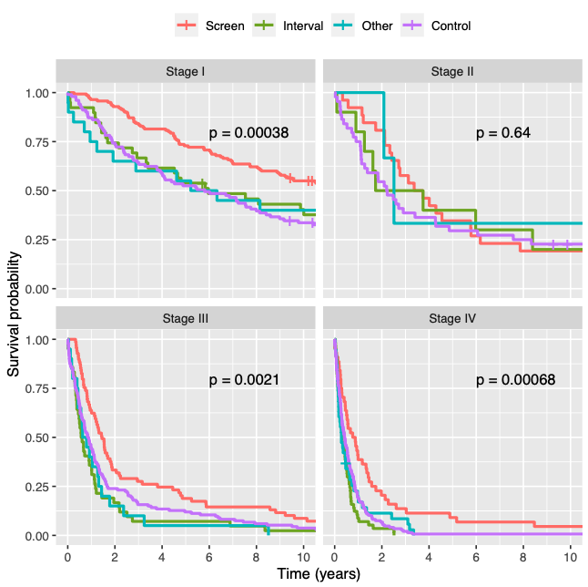

# Prognostic Value of Method of Detection in Lung Cancer

This repository contains code used to produce plots and tables in the paper


Long, J.P. and Shen, Y., 2023. Detection method has independent prognostic significance in the PLCO lung screening trial. Scientific reports, 13(1), p.13382. [pdf](https://rdcu.be/dskKX)


This study was conducted under [PLCO Project 808](https://cdas.cancer.gov/approved-projects/3140/)

<center>

</center>
  
## Code and Output

* Code to generate all figures and tables in the manuscript is contained in the file:
```
reports-code/20230126-plco-lung-report.Rmd
```
* This code creates a .html file and outputs figures and tables to the folder:
```
reports-code/20230126-plco-lung-report/
```
* Data (see below for instruction on how to obtain it) should be placed in folder
```
data/
```

## Obtaining the Data

* PLCO Lung data is needed to run the code and reproduce the results.
* PLCO Data may be requested from the [Cancer Data Access System](https://cdas.cancer.gov/)
* Request to obtain the same data as was used in [PLCO Project 808](https://cdas.cancer.gov/approved-projects/3140/) (this project)
* After unzipping files in the folder data/, the 20230126-plco-lung-report.Rmd can generate results.
